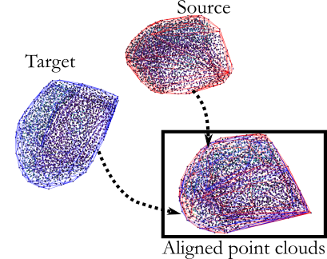
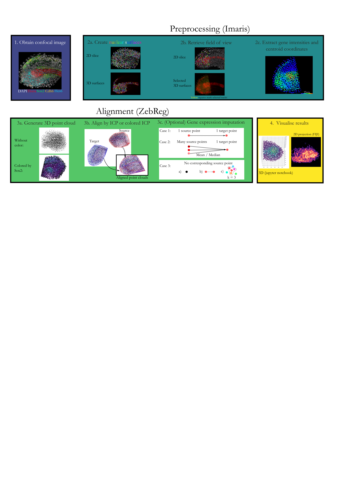

# ZebReg
Note: ZebReg was designed in a collaboration between Dillan Saunders and myself. 

## Brief introduction

ZebReg is a 3D, non-landmark-based image registration python tool which we developed to integrate cellular position and nuclear gene-expression information from confocal images of zebrafish tailbuds. Leveraging upon the open-source open3D library (Zhou et al., 2018), ZebReg implements a set of rigid body, point-based registration algorithms that are popular in the field of geometric registration to align a 3D point cloud (source cloud) into a reference point cloud (target cloud). 

Briefly, ZebReg performs the alignment by first identifying the centroid of segmented nuclei and converting each image into a cloud of points (point cloud). Then, given a set of point cloud images (source clouds) and a reference point cloud (target cloud), ZebReg finds the best linear transformation (no shearing, stretching or other deformations) between each source cloud and the target cloud. Additionally, if color intensities of the source clouds are provided, ZebReg can map them onto the target cloud to generate a composite image

## Pipeline

